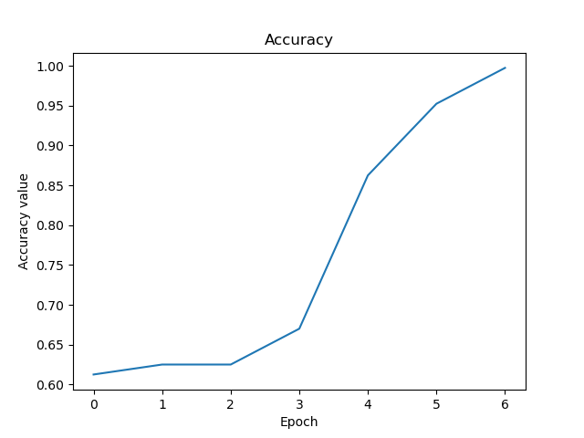
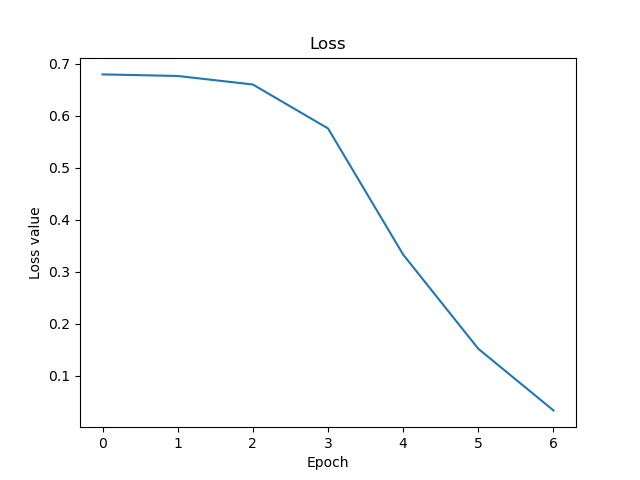

# Mood Detector
- A python package/application that detects the mood of a person using a live feed from the webcam or from pictures.
- An application of this project is to detect the mood of people and suggest activities based on the prediction of the model.
- Another application of this project is to find the correlation between activities and their impact on the mood of people.

Contents
----
- [Dependencies](#dependencies)
- [Installing Dependencies](#installing-dependencies)
- [Usage](#usage)

Dependencies
----
1. [OpenCV-python](https://pypi.org/project/opencv-python/)
  - To read webcam inputs
  - To detect faces in the frames of videos using [Haarcascade Classifier](https://github.com/opencv/opencv/blob/master/data/haarcascades/haarcascade_frontalface_default.xml)
  - To resize/convert/save/load images.
2. [TensorFlow](https://pypi.org/project/tensorflow/)
  - To normalize input data
  - To define the model using `tensorflow.keras` - Convolutional Neural Network Model (CNN)
  - To load/save/train the model
3. [Numpy](https://pypi.org/project/numpy/) for arrays (`numpy.array`)
4. [Matplotlib](https://pypi.org/project/matplotlib/) for plotting training/testing accuracy and error

Installing Dependencies
----
Install the aforementioned dependencies using: 
`pip install opencv-python tensorflow numpy matplotlib`

Usage
----
1. Open MoodDetector\CONSTANTS.py and change the below values as necessary.
    - `MOODS`: A list of the different moods the model will learn to detect/identify.
    - `TRAIN_SIZE_PER_MOOD`: The number of images per mood.
    - `EPOCHS`: The number of training loop iterations.
2. Open a Terminal (Command Prompt/Bash/etc.)
3. Traverse to the root directory of the project.
4. Run `python App.py -t/-T/train` to collect data and train the model.
5. Run `python App.py -d/-D/detect` to open a webcam and detect the moods of the faces in the frame.
6. Press spacebar to exit.

Sample
----
Below is results of sample model trained on two moods: happy and sad, 250 images per mood for a total of 10 epochs.

As you can see from the above GIF, the model adequately classifies the reaction of my face into the different moods.
Moreover, two graphs Acc vs Epoch and Loss vs Epoch are displayed below.

|y-axis vs x-axis|Graph|
|---|---|
|Accuracy vs Epoch||
|Loss vs Epoch||
